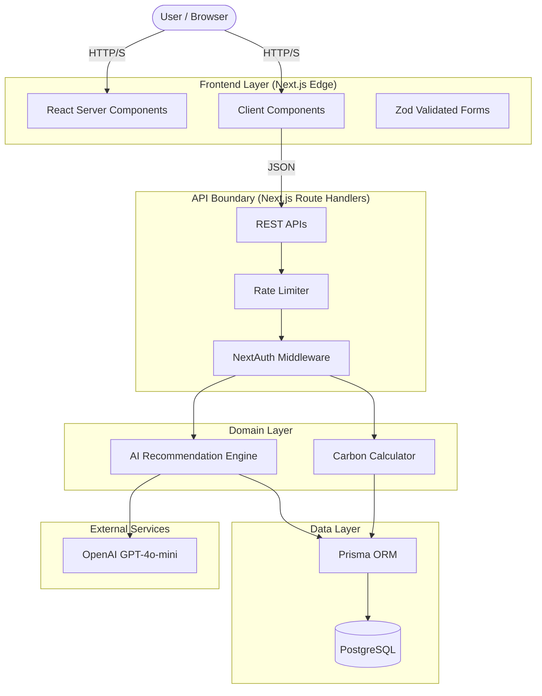

# System Architecture

EcoWise AI is built on a modern, layered, serverless architecture using Next.js 14 App Router, ensuring strict separation of concerns, global scalability, and high security.

## High-Level Architecture (C4 Model)

## Key Architectural Decisions

1. **Serverless First:** Deployed via Vercel Edge/Serverless functions to scale infinitely without container management overhead.
2. **Domain-Driven Design (DDD):** Business logic (carbon calculation) is strictly decoupled from the web framework (Next.js Route Handlers) to ensure testability.
3. **Zod API Boundary:** Every single API endpoint validates the incoming payload using strict Zod schemas, stripping out unexpected fields before the Domain layer sees them.
4. **AI Abstraction:** The AI engine utilizes the Vercel AI SDK to seamlessly switch between local rule-based templates and LLM integration via `generateObject()` with structured JSON schemas.
